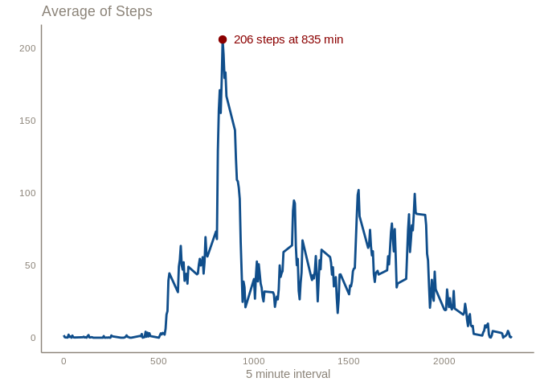

# 0 LOADING PACKAGES

To run the analysis, the package *tidyverse* will be loaded.


```r
library(tidyverse)
library(knitr)
```


# 01 LOADING AND PRE PROCESSING DATA

To read the zip file directly, the package *readr* will be used. The function was configured using the Rstudio UI option, and the code was replicated here so the reproducibility is maintained.


```r
activity <- read_csv("activity.zip", col_types = cols(steps = col_double()))
```

## Summary the data

All variables for activity were summarized together to save space. There are three variables on the dataframe: (1) **steps** (number of steps taking in a 5-minute interval, (2) **date** (the date on which the measurement was taken in YYYY-MM-DD format) and (3) **interval** (identifier for the 5-minute interval in which measurement was take).


```r
summary(activity)
```

```
##      steps             date               interval     
##  Min.   :  0.00   Min.   :2012-10-01   Min.   :   0.0  
##  1st Qu.:  0.00   1st Qu.:2012-10-16   1st Qu.: 588.8  
##  Median :  0.00   Median :2012-10-31   Median :1177.5  
##  Mean   : 37.38   Mean   :2012-10-31   Mean   :1177.5  
##  3rd Qu.: 12.00   3rd Qu.:2012-11-15   3rd Qu.:1766.2  
##  Max.   :806.00   Max.   :2012-11-30   Max.   :2355.0  
##  NA's   :2304
```

# 02 MEAN STEPS TAKEN BY DAY

Splitting the data by different days, the average value of steps is 9354 and the median is 10395 steps.


```r
stepDay <- activity %>%
  group_by(date) %>%
  summarise(total = sum(steps, na.rm = TRUE))

summary(stepDay$total)
```

```
##    Min. 1st Qu.  Median    Mean 3rd Qu.    Max. 
##       0    6778   10395    9354   12811   21194
```

```r
ggplot(stepDay, aes(total)) +
  geom_histogram(fill = "dodgerblue4") +
  geom_vline(aes(xintercept = mean(total), col = "darkred"), size = 1, linetype = 4 ) +
  geom_vline(aes(xintercept = median(total), col = "green"), size = 1, linetype = 4 ) +
  scale_color_identity(guide = "legend",
                       name = "Stats from Steps",
                       labels = c("Mean", "Median")) +
  labs(x = "Steps", 
       y = "",
       title = "Counts of Steps",
       subtitle = "Daily Basis") +
  theme_minimal() +
  theme(panel.border = element_blank(), 
        panel.grid.major = element_blank(),
        panel.grid.minor = element_blank(), 
        axis.line = element_line(colour = "antiquewhite4"),
        axis.title = element_text(colour = "antiquewhite4"),
        axis.text = element_text(colour = "antiquewhite4"),
        plot.title = element_text(colour = "antiquewhite4"),
        plot.subtitle = element_text(colour = "antiquewhite4"),
        strip.text = element_text(colour = "antiquewhite4"))
```

<!-- -->

# 03 AVERAGE STEPS FOR 5 MINUTES INTERVAL 

Below there is a time series of the averages of steps taken for all 5 minutes interval across all days. The maximum average of steps happens at 835 minutes, with a value of 206 (rounded). 


```r
stepInterval <- activity %>%
  group_by(interval) %>%
  summarise(mean = mean(steps, na.rm = TRUE))

ggplot(stepInterval, aes(x = interval, y = mean)) +
  geom_line(colour = "dodgerblue4", size = 1) +
  labs(x = "5 minute interval", 
       y = "",
       title = "Average of Steps") +
  theme_minimal() +
  theme(panel.border = element_blank(), 
        panel.grid.major = element_blank(),
        panel.grid.minor = element_blank(), 
        axis.line = element_line(colour = "antiquewhite4"),
        axis.title = element_text(colour = "antiquewhite4"),
        axis.text = element_text(colour = "antiquewhite4"),
        plot.title = element_text(colour = "antiquewhite4"),
        plot.subtitle = element_text(colour = "antiquewhite4"),
        strip.text = element_text(colour = "antiquewhite4")) +
  geom_point(data = stepInterval[which.max(stepInterval$mean), ], color = "darkred", size = 3) +
  geom_text(data = stepInterval[which.max(stepInterval$mean), ], color = "darkred", size = 4,
            label = paste(round(stepInterval$mean[which.max(stepInterval$mean)]), "steps at", stepInterval$interval[which.max(stepInterval$mean)], "min", sep = " "),
            hjust = -0.1)
```

<!-- -->


# 04 TREATING MISSING VALUES

The NA’s values from variable **steps** are distributed along whole dataset and represent 13% of all data (2304 data points).


```r
stepNA <- is.na(activity$steps)

summary(activity$date[stepNA])
```

```
##         Min.      1st Qu.       Median         Mean      3rd Qu. 
## "2012-10-01" "2012-10-26" "2012-11-06" "2012-11-01" "2012-11-11" 
##         Max. 
## "2012-11-30"
```

```r
sum(stepNA)
```

```
## [1] 2304
```


```r
mean(stepNA)
```

```
## [1] 0.1311475
```

```r
activity %>%
  filter(is.na(steps)) %>%
  ggplot(aes(date)) +
  geom_histogram(fill = "dodgerblue4") +
  labs(x = "Date", 
       y = "",
       title = "Counts of NA's for Step Variable") +
  theme_minimal() +
  theme(panel.border = element_blank(), 
        panel.grid.major = element_blank(),
        panel.grid.minor = element_blank(), 
        axis.line = element_line(colour = "antiquewhite4"),
        axis.title = element_text(colour = "antiquewhite4"),
        axis.text = element_text(colour = "antiquewhite4"),
        plot.title = element_text(colour = "antiquewhite4"),
        plot.subtitle = element_text(colour = "antiquewhite4"),
        strip.text = element_text(colour = "antiquewhite4"))
```

<!-- -->

The missing values were replaced by the median of the steps, calculated by each 5 minute interval. 


```r
stepMedian <- activity %>%
  group_by(interval) %>%
  summarise(median = median(steps, na.rm = TRUE))

stepImp <- activity %>%
  left_join(stepMedian) 

stepImp$steps[is.na(stepImp$steps)] <- stepImp$median[is.na(stepImp$steps)]

stepDay2 <- stepImp %>%
  group_by(date) %>%
  summarise(total = sum(steps, na.rm = TRUE))

summary(stepDay2$total)
```

```
##    Min. 1st Qu.  Median    Mean 3rd Qu.    Max. 
##      41    6778   10395    9504   12811   21194
```


```r
ggplot(stepDay2, aes(total)) +
  geom_histogram(fill = "dodgerblue4") +
  geom_vline(aes(xintercept = mean(total), col = "darkred"), size = 1, linetype = 1 ) +
  geom_vline(aes(xintercept = median(total), col = "green"), size = 1, linetype = 1 ) +
  geom_vline(data = stepDay, aes(xintercept = mean(total), col = "darkred"), size = 1, linetype = 4) + 
  geom_vline(data = stepDay, aes(xintercept = median(total), col = "green"), size = 1, linetype = 4) + 
  scale_color_identity(guide = "legend",
                       name = "Stats",
                       labels = c("Mean", "Median")) +
  labs(x = "Steps", 
       y = "",
       title = "Counts of Steps",
       subtitle = "Daily Basis - Dashed Line are not imputaded") +
  theme_minimal() +
  theme(panel.border = element_blank(), 
        panel.grid.major = element_blank(),
        panel.grid.minor = element_blank(), 
        axis.line = element_line(colour = "antiquewhite4"),
        axis.title = element_text(colour = "antiquewhite4"),
        axis.text = element_text(colour = "antiquewhite4"),
        plot.title = element_text(colour = "antiquewhite4"),
        plot.subtitle = element_text(colour = "antiquewhite4"),
        strip.text = element_text(colour = "antiquewhite4"))
```

<!-- -->

# 05 ACTIVITIE DIFFERENCE BETWEEN WEEK DAYS AND WEEK ENDS

The *weekdays()* function was used to determine the weekdays name for **date** variable. The result was stored at **wday** variable. Then, an *if.else* flow was used to transform the character value from **wday** to a two level factor, stored in **wknd**. The imputed data frame was used to this computations. 

After the factor creation, the steps was summarized by mean, grouped by 5 minute interval and week day or week end. 


```r
stepImp$wday <- weekdays(stepImp$date)

stepImp$wknd <- as.factor(ifelse(stepImp$wday == "sábado" |
                                   stepImp$wday == "domingo", "Weekend", "Weekday"))

stepWeekend <- stepImp %>%
  group_by(interval, wknd) %>%
  summarise(mean = mean(steps, na.rm = TRUE))

stepMedian <- stepWeekend %>%
  group_by(wknd) %>%
  summarise(median = median(mean))

stepMean <- stepWeekend %>%
  group_by(wknd) %>%
  summarise(mean = mean(mean))
```


```r
ggplot(stepWeekend, aes(x = interval, y = mean)) + 
  facet_grid(. ~ wknd) +
  geom_line(color =  "dodgerblue4", size = 1) +
  geom_hline(data = stepMedian, aes(yintercept = median, color = "orange"), size = 1.5) +
  geom_hline(data = stepMean, aes(yintercept = mean, color = "grey"), size = 1.5) +
  scale_color_identity(guide = "legend",
                       name = "Steps stats",
                       labels = c("Total Mean", "Total Median")) +
  labs(title = "Comparison of activity level between weekdays and weekends",
       subtitle = "Mean of steps",
       y = "",
       x = "5 minute interval") +
  theme_minimal() + 
  theme(panel.border = element_blank(), 
        panel.grid.major = element_blank(),
        panel.grid.minor = element_blank(), 
        axis.line = element_line(colour = "antiquewhite4"),
        axis.title = element_text(colour = "antiquewhite4"),
        axis.text = element_text(colour = "antiquewhite4"),
        plot.title = element_text(colour = "antiquewhite4"),
        plot.subtitle = element_text(colour = "antiquewhite4"),
        strip.text = element_text(colour = "antiquewhite4"),
        legend.text = element_text(colour = "antiquewhite4"),
        legend.title = element_text(colour = "antiquewhite4")
  )
```

<!-- -->

The general acrivity seems to be a liitle higher on weekend, no matter if you consider the total mean of total median.


